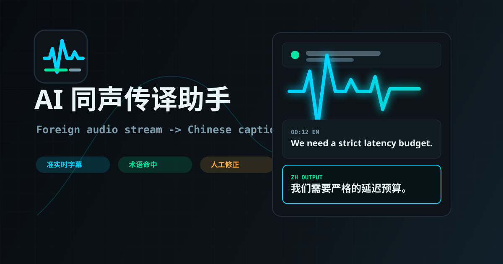

# AI 同声传译助手



本作品选择比赛题目二：**AI 同声传译助手**。

目标是在 2026-06-05 00:00 至 2026-06-07 23:59 的开发周期内，完成一个能将外语音频流实时翻译成中文，并支持字幕/语音输出与翻译修正能力的 AI 应用。

## 当前阶段

PR-14：演示材料与提交文案完善。

当前已建立 Vite + React 前端工程和 Node 后端代理，完成同传字幕工作台、Web Speech API STT、OpenAI-compatible 流式翻译、DashScope Qwen-ASR 后端代理、翻译修正闭环、稳定 Demo 模式、文件上传真实转写、直播标签页/屏幕音频捕获与 MediaRecorder 分片 ASR、高级设置、Web Audio 波形、浏览器中文 TTS、SRT / 双语文本 / 同传复盘报告导出。页面包含输入源选择、Provider 配置、File/Live ASR 配置、术语表、质量诊断、修正记忆、字幕设置、时间轴字幕流、修正编辑器、底部大字幕和统计栏。

Demo 视频：待录制，提交前替换为公开可访问链接。

录屏讲解脚本见 `docs/demo-script.md`。

最终演示路径见 `docs/final-demo-path.md`。

轻量 AI Gateway 设计见 `docs/backend-gateway.md`。

阿里云百炼 DashScope 配置见 `docs/dashscope-bailian-setup.md`。

视觉系统与页面层级设计见 `docs/visual-system.md`。

## 快速开始

```bash
cd interpreter
npm install
npm run dev
```

开发服务器默认运行在 `http://localhost:5173`。

真实 ASR / 翻译推荐同时启动本地后端代理：

```bash
cd interpreter
copy .env.example .env
# 在 .env 中填写 DASHSCOPE_API_KEY
npm run dev:server
```

然后另开一个终端运行 `npm run dev`。Vite 会把 `/api/*` 转发到 `http://localhost:8787`。未启动后端时，Demo 模式仍可完整演示；填写浏览器内存 Key 时也可以继续走浏览器直连。

如果使用阿里云百炼免费额度，默认可以让同一个 `DASHSCOPE_API_KEY` 同时驱动翻译和 ASR。当前默认翻译模型为 `qwen-plus`，默认 ASR 模型为 `qwen3-asr-flash`：

```env
DASHSCOPE_API_KEY=你的阿里云百炼DashScope Key
DASHSCOPE_BASE_URL=https://dashscope.aliyuncs.com/compatible-mode/v1
DASHSCOPE_TRANSLATION_MODEL=qwen-plus
ASR_PROVIDER=dashscope
DASHSCOPE_ASR_BASE_URL=https://dashscope.aliyuncs.com/compatible-mode/v1
DASHSCOPE_ASR_MODEL=qwen3-asr-flash
```

如需换成 OpenAI 或其他 OpenAI-compatible 网关，可再填写 `OPENAI_TRANSLATION_BASE_URL`、`OPENAI_TRANSLATION_API_KEY`、`OPENAI_TRANSLATION_MODEL` 等覆盖项。很多第三方聊天网关只支持 `/chat/completions`，不支持语音转写。可用以下命令检查当前 `.env` 的接口可达性：

前端默认翻译 Provider 为 `Server Gateway`，因此不需要在浏览器里填写 Key；启动本地后端后会自动通过 `/api/translate` 使用 `.env` 中的百炼 Key。

```bash
npm run check:api
```

本地后端定位为轻量 AI Gateway，只负责 Key 隔离、Provider 适配和统一错误边界，不做用户系统、数据库或字幕业务存储。

验证命令：

```bash
npm test
npm run check:api
npm run smoke:file-asr
npm run build
```

`npm test` 使用 Node 原生测试覆盖质量诊断、修正记忆、SRT 和同传复盘报告生成。`npm run smoke:file-asr` 会使用 `test-media/sample-english-speech.wav` 上传到本地后端；未配置 `DASHSCOPE_API_KEY` 或其他 ASR Key 时应明确通过 `missing_server_key` 边界测试，配置 Key 后会要求返回真实英文转写。样本来源和下载方式见 `docs/file-asr-smoke.md`。

## STT 验证

Chrome 或 Edge 中打开本地页面，点击输入源 `Mic`，再点击 `Start Interpreting` 后授权麦克风。说英文时，当前识别中的英文会显示在字幕区；完整句 final 后会进入翻译管线。未填写 API Key 时会显示明确的占位提示，不会伪装成真实翻译成功。

## 翻译验证

当前翻译引擎支持 OpenAI-compatible SSE 流式响应。左侧 `Configuration -> Translate` 可选择 DeepSeek、Server Gateway 或 Custom，并填写 API Key；API Key 只保存在当前页面内存状态中，不写入 localStorage。若启动了本地后端并在 `.env` 配置 `DASHSCOPE_API_KEY`，选择 `Server Gateway` 且浏览器 Key 为空时，前端会优先通过 `/api/translate` 使用服务端代理。

## 修正闭环验证

页面加载后会初始化术语表；字幕需要通过 Demo、Mic、File 或 Live 工作流产生：

1. 点击任意字幕卡片。
2. 在 `Correction Desk` 编辑中文译文。
3. 点击 `Save correction`，字幕会标记为用户修正，修正计数增加。
4. 在左侧术语表输入 source 和中文译法，点击 `Add term`。
5. 点击 `Retranslate with glossary`，命中术语的字幕会标记为术语命中。
6. 页面会在 `Risk Review` 中提示疑似漏译、术语未命中、占位翻译等风险。
7. 人工保存过的修正会进入 `Correction Memory`，后续真实翻译 prompt 会参考这些用户确认译文。

## Demo 模式验证

不填写 API Key 也可以验证完整产品闭环：

1. 保持输入源为 `Demo`。
2. 点击 `Start Interpreting`。
3. 字幕会按时间逐条出现，而不是一次性显示全部内容。
4. 示例脚本包含 `latency budget`、`pitch deck`、`edge device` 三个术语。
5. Demo 字幕仍可继续执行人工修正、添加术语和术语重译。

## 文件模式验证

1. 点击输入源 `File`，可点击 `Use sample audio` 一键加载内置英文样本，也可上传 `.mp3`、`.mp4`、`.wav`、`.m4a`、`.webm` 或 `.ogg` 文件。
2. 推荐启动已配置 `DASHSCOPE_API_KEY` 的本地后端代理；默认国产 ASR 模型为 `qwen3-asr-flash`。如需 OpenAI ASR，可把 `.env` 中 `ASR_PROVIDER` 改为 `openai`。
3. 内置样本来自 `test-media/sample-english-speech.wav`，并复制到 `public/demo-media/` 供页面一键加载；左侧会显示文件名、大小、格式和时长。
4. 点击 `Start Interpreting` 后，系统会把文件发送到本地 `/api/transcribe`，再由 Gateway 转给 DashScope Qwen-ASR 或可选 OpenAI-compatible ASR。
5. 转写结果会按英文句子进入现有中文翻译、字幕修正、术语命中、TTS 和导出流程。
6. 如果未填写浏览器 ASR Key 且后端没有配置 Key，内置样本会明确提示并使用绑定英文转写文本继续跑完 File 主线；普通文件会降级为演示转写流，不会伪装成真实 ASR。
7. 如果翻译 Key 不可用，系统会使用标注的本地演示译文，确保字幕修正、术语命中、TTS 和导出仍可演示。
8. 当前前端仍限制单次上传 25MB；更大文件可继续扩展后端分片上传。

## 直播模式验证

1. 点击输入源 `Live`。
2. Live 面向网页直播、社交平台直播、媒体直播和线上会议；产品路径为 `Select live source -> Capture browser audio -> Chunk ASR -> Chinese captions -> Correction & export`。
3. 推荐启动已配置 `DASHSCOPE_API_KEY` 的本地后端代理；Live 会复用同一套 `/api/transcribe` 配置。若使用 OpenAI ASR，可把 `.env` 中 `ASR_PROVIDER` 改为 `openai`。
4. 点击 `Choose live audio`，选择一个带英文音频的浏览器标签页或屏幕，并确认共享音频。
5. 左侧会显示捕获来源、权限状态、ASR 配置状态、分片长度、字幕输出状态和 Live 统计。
6. 如果浏览器支持 MediaRecorder，系统会按设置的音频分片长度持续转写直播音频，并把转写文本送入翻译链路。
7. 未填写浏览器 ASR Key 且后端没有配置 Key 时，Live 只展示捕获、波形和配置缺口，不会伪装为真实转写。

## 设置面板验证

- 顶部点击 `Settings` 可打开高级设置面板。
- 支持配置目标语言、翻译风格、上下文窗口、音频分片长度和专业词汇增强。
- Provider、Custom Base URL 和翻译参数会保存到 localStorage。
- API Key 只保存在当前内存状态中，不写入 localStorage。

## 字幕显示验证

- 右上 `Bilingual` / `ZH only` / `EN only` 会实时切换字幕展示方式。
- 左侧 `Subtitle Settings` 可控制是否显示英文原文、底部大字幕、修正记忆和中文语音输出。
- 关闭 `Auto correction memory` 后，后续真实翻译不会注入人工修正记忆。

## 波形验证

- 文件模式开始播放后，波形条会读取 `<audio>` 的 Web Audio 频谱数据。
- 直播模式捕获音频后，波形条会读取 `MediaStream` 的频谱数据。
- 没有真实音频输入时，页面保留静态 fallback 波形，避免界面空白。

## TTS 验证

- 打开左侧 `Chinese voice output`。
- Demo 或文件模式产生稳定中文字幕后，浏览器会使用系统中文语音播报。
- `Settings` 中可调整语速，浏览器原生音色取决于当前系统/浏览器可用语音。
- 停止翻译会立即取消播报队列，避免停止后继续朗读。

## 导出验证

- 点击顶部 `Export` 会下载 SRT 字幕文件。
- 点击顶部 `Review` 会下载 Markdown 同传复盘报告，包含质量诊断、术语表、修正记录和完整双语转写。
- 点击顶部 `Copy` 会复制当前双语文本；如果浏览器剪贴板不可用，则降级下载文本文件。
- 导出内容使用当前字幕状态，因此会包含人工修正后的最终译文。

## 计划功能

- 麦克风英文语音实时识别与中文字幕输出：已完成浏览器 Web Speech API MVP。
- 文件音频真实 ASR：已完成 DashScope Qwen-ASR 国产后端代理入口，并保留 OpenAI `/audio/transcriptions` 可选入口；未配置 Key 时降级为稳定演示流。
- Demo 音频流：已完成英文语音模拟 + 中文流式字幕，用于无 Key 稳定演示。
- AI 流式翻译：已完成 OpenAI-compatible SSE 引擎、Provider 配置与 `/api/translate` 服务端代理。
- 人工修正字幕译文：已完成。
- 术语表与术语命中：已完成。
- 质量诊断与修正记忆：已完成，支持风险标签、Risk Review 和用户修正记忆 prompt。
- 上下文自动重译：已完成术语重译入口，后续可扩展更多上下文策略。
- SRT / 双语文本导出：已完成。
- 同传复盘报告导出：已完成，包含风险诊断、术语表、修正记录和完整双语转写。
- 可选中文 TTS 播报：已完成浏览器原生中文语音输出。

## 能力边界

当前作品聚焦比赛题目二要求的“外语音频流实时翻译成中文、字幕/语音输出、翻译修正能力”。为了保证 72 小时内可稳定演示，系统提供三层能力：

- 稳定评审闭环：Demo 模式可以在无 Key 情况下稳定展示“外语音频流输入 -> 中文字幕输出 -> 人工修正 -> 术语重译 -> TTS 播报 -> 导出”。
- 真实浏览器能力：Mic 使用 Web Speech API 做英文语音识别；File 模式可通过本地 Gateway 调用 DashScope 或可选 OpenAI ASR 做真实文件转写；Live 模式可通过 MediaRecorder 分片调用 ASR；Provider 配置后可走真实 OpenAI-compatible 流式翻译。
- 翻译修正能力：人工修正会写入 Correction Memory，并作为后续翻译提示的一部分；Risk Review 会提示漏译、术语未命中和占位翻译。
- 能力限制：Live ASR 依赖浏览器 MediaRecorder、用户共享音频权限、ASR Key 和网络质量；分片转写不是毫秒级实时，适合 4 秒左右的准实时字幕。

## 已完成 PR 记录

1. PR-02：全局状态管理
2. PR-03：UI 框架与静态布局
3. PR-04：STT 引擎
4. PR-05：AI 流式翻译引擎
5. PR-06：翻译修正闭环
6. PR-07：Demo 时间轴字幕流
7. PR-08：SRT / 双语文本导出
8. PR-09：文件上传播放驱动字幕流
9. PR-10：直播系统音频捕获入口
10. PR-11：Provider 与翻译设置面板
11. PR-12：Web Audio 波形可视化
12. PR-13：浏览器中文 TTS 播报
13. PR-14：演示材料、README 和提交文案完善

## 后续扩展

- 优化 Live ASR 分片去重、静音过滤和延迟统计。
- 增加自动质量评估，例如延迟、漏译率、术语命中率和人工修正前后对比。
- 提交前录制 Demo 视频，并将公开链接替换到 README 顶部。
